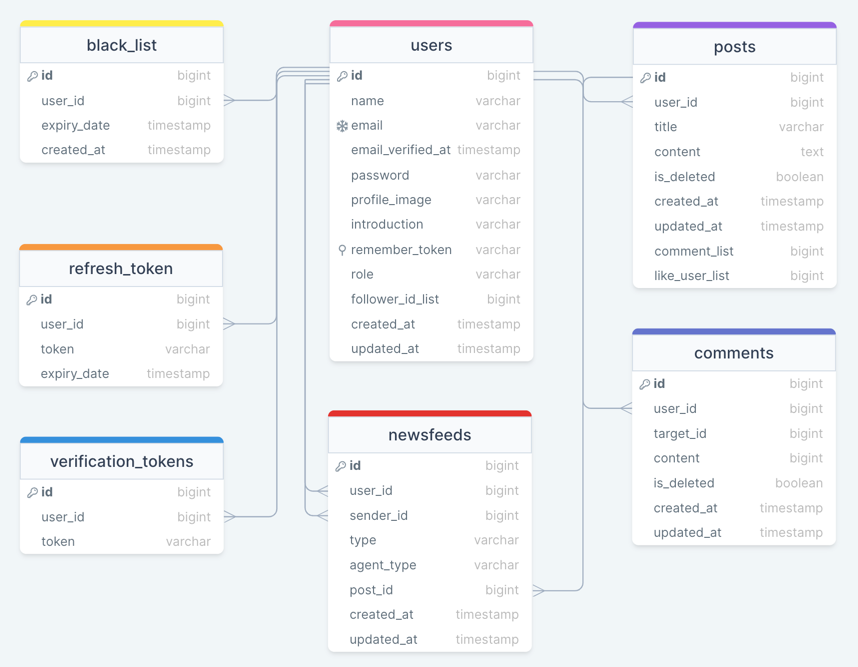

# newsfeed-backend

이 프로젝트는 Microservices Architecture(MSA)를 활용하여 구현된 소셜 네트워킹 플랫폼의 백엔드 서비스입니다.

## 목차

- [사용된 기술](#사용된-기술)
- [모듈](#모듈)
- [문서](#문서)
- [실행하는 법](#실행하는-법)

## 사용된 기술

- Java SDK 17
- Spring Boot 2.7.9
- MongoDB
- Docker
- Eureka

## 모듈

| 서비스           | 설명                                       | 권한 부여          | 포트 번호 |
|---------------|------------------------------------------|----------------|-------|
| 사용자 서비스       | 사용자 관련 작업을 관리                            | jwt 토큰으로 권한 검사 | 8080  |
| 액티비티 서비스      | 사용자 활동을 관리 (팔로우, 포스팅, 댓글)                | -              | 8081  |
| 뉴스피드 서비스      | 뉴스피드 관련 기능을 처리                           | -              | 8082  |
| API 게이트웨이 서비스 | 외부 통신을 위한 게이트웨이 역할,<br/>요청을 적절한 서비스로 라우팅 | jwt 토큰으로 권한 검사 | 8000  |
| Eureka 서비스    | 서비스 검색 및 등록 담당                           | -              | 8761  |

## ERD



## 문서

> - [API 명세](https://linktodocumentation)

## 실행하는 법

> - 빌드하고 실행
> ```bash
> docker compose up --build
> ```
> - 단일 모듈 빌드 후 실행
> ```bash
> docker compose up --build {service-name}
> ```
> - 빌드하지 않고 실행
> ```bash
> docker compose up
> ```

<!--

# newsfeed-backend

This project is a backend service for a social networking platform implemented using Microservices
Architecture (MSA).

## Contents

> - [Tech Stack](#Tech-Stack)
> - [Modules](#Modules)
> - [Documentation](#Documentation)
> - [Run Locally](#Run-Locally)

## Tech Stack

> - Java SDK 17
> - Spring Boot 2.7.9
> - MongoDB
> - Docker
> - Eureka

## Modules

| Service             | Description                                                                                | Authorization           | Port |
|---------------------|--------------------------------------------------------------------------------------------|-------------------------|------|
| User Service        | Manages user-related operations.                                                           | jwt token authorization | 8080 |
| Activity Service    | Manages user activities. (follow, post, comment)                                           | -                       | 8081 |
| Newsfeed Service    | Handles newsfeed-related functionalities.                                                  | -                       | 8082 |
| API Gateway Service | Acts as a gateway for external communication,<br/>routes requests to appropriate services. | jwt token authorization | 8000 |
| Eureka Service      | Service discovery and registration.                                                        | -                       | 8761 |

## ERD


## Documentation

> - [API specification](https://linktodocumentation)

## Run Locally

> - Build and run
> ```bash
> docker compose up --build
> ```
> - Build and run single module
> ```bash
> docker compose up --build {service-name}
> ```
> - Run without building
> ```bash
> docker compose up
> ```
